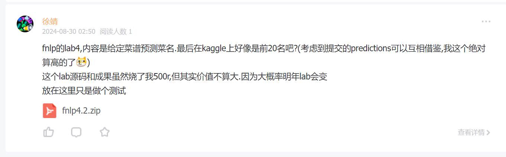

## 缺钱原因
- 我的脚本每个项目花费我10-500人民币不等,而使用这些脚本则成本趋近于0.
- 为支付昂贵的各类软件工具,大模型API,域名,GPU使用时长等,不得不收费

## 付费说明 

- 我采用在[知识星球](https://wx.zsxq.com/dweb2/index/group/48888522454818)上传文件的方式提供这些付费笔记
  - 只需在加入"星球"时付一次费,即可下载已有笔记,以及获取以后的更新,也就是一次性买断
  - 我相信这比树洞收资料便宜也靠谱的多(毕竟是本人微信大号而不是树洞小号背书×)
- 这些笔记,代码由人工or人工智能手写,不会泄露任何**不公开的学习资料,考试往年题**等.

## 欢迎同学们来我的网站卖笔记
- 分红暂定按**下载次数**加权计算
- 流程
  - 首先请在网站主页找到本人微信联系,找我要免费加入上面这个小圈的链接
  - 软件内(支持PC端)每次发资料就和发动态一样,参考:
  
  - 如果需要在我的主页宣传,请下载这个[markdown模版](https://iculizhi.github.io/files/nameofthemd.md),修改好后微信发我